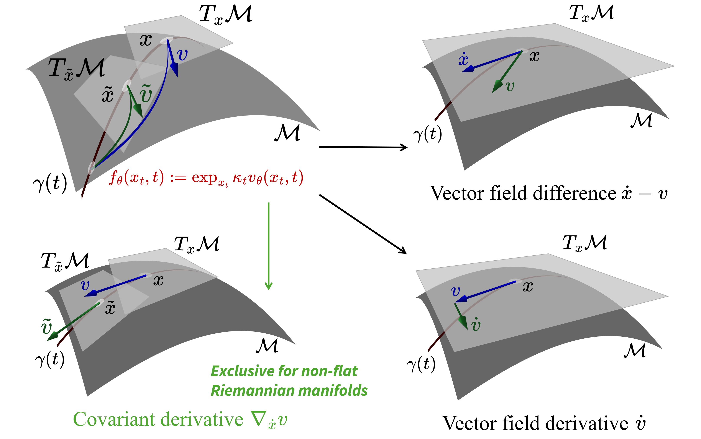

# Riemannian Consistency Model

Code by Chaoran Cheng & [Yusong Wang](https://github.com/yusowa0716), Nov 1, 2025

𝗥𝗶𝗲𝗺𝗮𝗻𝗻𝗶𝗮𝗻 𝗖𝗼𝗻𝘀𝗶𝘀𝘁𝗲𝗻𝗰𝘆 𝗠𝗼𝗱𝗲𝗹, 𝐶ℎ𝑎𝑜𝑟𝑎𝑛 𝐶ℎ𝑒𝑛𝑔, 𝑌𝑢𝑠𝑜𝑛𝑔 𝑊𝑎𝑛𝑔, 𝑌𝑢𝑥𝑖𝑛 𝐶ℎ𝑒𝑛, 𝑋𝑖𝑎𝑛𝑔𝑥𝑖𝑛 𝑍ℎ𝑜𝑢, 𝑁𝑎𝑛𝑛𝑖𝑛𝑔 𝑍ℎ𝑒𝑛𝑔, 𝑎𝑛𝑑 𝐺𝑒 𝐿𝑖𝑢, 𝑵𝒆𝒖𝒓𝑰𝑷𝑺 𝟐𝟎𝟐𝟓, [arXiv](https://arxiv.org/abs/2510.00983).

<p style="text-align: center;">

</p>
**Riemannian Consistency Model (RCM)** extends consistency models for the few-step generation setup on Riemannian manifolds, respecting the intrinsic geometry of the manifold by design to ensure better generation quality. Compared with the naive Euclidean consistency model on Riemannian manifolds, RCM achieves significant performance improvements in the two-step generation setup. Two variants of RCM are proposed: **Riemannian Consistency Distillation (RCD)** and **Riemannian Consistency Training (RCT)**. RCD distills a pre-trained Riemannian flow matching model into a few-step consistency model, whereas RCT trains a consistency model from scratch. We have proven the equivalence between RCD and RCT in our paper, relying on the mathematical property of the covariant derivative.

## Setup

We have provided the environment file `env.yml` for easy setup. You can create the conda environment by running:

```bash
conda create -f env.yml
conda activate rcm
```

By default, the data is expected to be in the `data/` folder, but this can be changed with the command-line argument.
To download the Earth datasets, run the following script:

```bash
mkdir -p data/sphere/
for file in fire flood quakes volc; do
    wget "https://raw.githubusercontent.com/louaaron/Scaling-Riemannian-Diffusion/refs/heads/main/earth_science/data_raw/${file}.csv" -P data/sphere/
done
```

To download the DNA and RNA angle datasets, run the following script:

```bash
mkdir -p data/torus/
wget "https://github.com/vislearn/FFF/raw/refs/heads/main/fff/data/raw_data/torus/protein.tsv" -P data/torus/
wget "https://github.com/vislearn/FFF/raw/refs/heads/main/fff/data/raw_data/torus/rna.tsv" -P data/torus/
```

To download the synthetic SO(3) dataset, download from the [Google Drive](https://drive.google.com/file/d/1db5dgRsgXnpRgDSO4xxHbO3J229zbfF0/view?usp=sharing) and run:

```bash
mkdir -p data/so3/
unzip raw.zip -d data/so3/
mv data/so3/raw/* data/so3/
rmdir data/so3/raw
```

## Training & Evaluation

The framework of this repo is built upon the EDM2 [repo](https://github.com/NVlabs/edm2). `train.py` and `consistency_train.py` are the main entry points for training Riemannian flow matching models and Riemannian consistency models, respectively. 

To train a Riemannian flow matching model that works as the teacher model for the distillation (RCD variants), run commands like:
```bash
CUDA_VISIBLE_DEVICES=0 torchrun --standalone --nproc_per_node=1 train.py --outdir=training-runs --precond flow --duration 50 --batch 512 --dropout 0.0 \
    --tick 20 --snap 10 --dump 100 --seed 0 --lr 1.e-3 --data data/sphere --dataset-name Earthquake --manifold Sphere
```
The model checkpoints and logs will be saved in the `training-runs/` folder as specified in the `--outdir` argument. By default, the directory name will be something like `00001-Earthquake-flow-gpus1-batch512`, where `00001` is the unique run index.

To train a Riemannian consistency distillation model (RCD variants), run commands like:
```bash
CUDA_VISIBLE_DEVICES=0 torchrun --standalone --nproc_per_node=1 consistency_train.py --outdir=consis-training-runs-sphere --precond flow --duration 50 --batch 512 --dropout 0.0 \
    --tick 20 --snap 10 --dump 100 --seed 0 --lr 1.e-4 --data data/sphere --dataset-name Earthquake --manifold Sphere --loss-type Continuous \
    --transfer training-runs/00001-Earthquake-flow-gpus1-batch512/network-snapshot-050000.pkl --distillation true \
    --teacher training-runs/00001-Earthquake-flow-gpus1-batch512/network-snapshot-050000.pkl
```
The `--transfer` argument specifies the pre-trained RFM model checkpoint as the warm start.
To train a Riemannian consistency model from scratch (RCT variants), run commands like:
```bash
CUDA_VISIBLE_DEVICES=0 torchrun --standalone --nproc_per_node=1 consistency_train.py --outdir=consis-training-runs-sphere --precond flow --duration 50 --batch 512 --dropout 0.0 \
    --tick 20 --snap 10 --dump 100 --seed 0 --lr 1.e-4 --data data/sphere --dataset-name Earthquake --manifold Sphere --loss-type Continuous --distillation false
```
To use the discrete-time RCM loss, specify `--loss-type Discrete` instead. To use the simplified RCM loss, add the `--simplified-loss` flag. The model checkpoints and logs will be saved in the `consis-training-runs-sphere/` folder as specified in the `--outdir` argument. By default, the directory name will be something like `00001-Earthquake-Continuous-consistency-gpus1-batch512`.

For both scripts, the available datasets are
- Sphere datasets:
  - `--data data/sphere --dataset-name Earthquake`. The earthquake epicenter dataset on a 2D sphere.
  - `--data data/sphere --dataset-name Volcano`. The volcanic eruption dataset on a 2D sphere.
  - `--data data/sphere --dataset-name Fire`. The wildfire dataset on a 2D sphere.
  - `--data data/sphere --dataset-name Flood`. The flood dataset on a 2D sphere.
- Torus datasets:
  - `--dataset-name Board`. The 2D checkerboard dataset on a 2D torus.
  - `--data data/torus/protein.tsv --dataset-name Protein`. The aggregated protein backbone dihedral angle dataset on a 2D torus.
  - `--data data/torus/rna.tsv --dataset-name RNA`. The aggregated RNA backbone dihedral angle dataset on a 7D torus.
- SO(3) dataset:
  - `--dataset-name Rotation`. The synthetic Swiss roll dataset on SO(3).
  - `--data data/so3/ --dataset-name Cone`. The synthetic cone dataset on SO(3).
  - `--data data/so3/ --dataset-name Fisher`. The synthetic "fisher24" dataset on SO(3).
  - `--data data/so3/ --dataset-name Line`. The synthetic line dataset on SO(3).
  - `--data data/so3/ --dataset-name Peak`. The synthetic peak dataset on SO(3).

The "Peak" SO(3) dataset is too easy for all CM models, with all models achieving near-zero MMDs results. We recommend using the other SO(3) datasets for better benchmarking.
The available `--manifold` options are `Sphere`, `Torus`, `SO3`, and `Euclidean` (for naive CM). Make sure to choose the correct manifold according to the dataset.
Evaluation scripts are available in the notebooks under the `notebooks/` folder. Visualization scripts are also provided in the corresponding notebooks.

The detailed options are provided below:

<details>
<summary>Detailed training options</summary>

```
Usage: train.py [OPTIONS]                                                        
                                                                                 
Options:                                                                         
  --num-samples N     Samples in datasets  [default: 10000]    
  --data STR          Dataset path                                               
  --dataset-name STR  Dataset name  [default: Board]       
  --manifold STR      Which manifold the data is on  [default: Torus]
  --outdir DIR        Where to save the results  [required]
  --precond flow      Preconditioning & loss function  [default: flow]
  --duration MIMG     Training duration  [default: 200; x>0]
  --precond flow      Preconditioning & loss function  [default: flow]                                                                                     
  --duration MIMG     Training duration  [default: 200; x>0]                                                                                                       
  --batch INT         Total batch size  [default: 512; x>=1]                     
  --batch-gpu INT     Limit batch size per GPU  [x>=1]                                                                                                             
  --lr FLOAT          Learning rate  [default: 0.001; x>0]                                                                                                         
  --ema MIMG          EMA half-life  [default: 0.5; x>=0]
  --dropout FLOAT     Dropout probability  [default: 0.13; 0<=x<=1]              
  --ls FLOAT          Loss scaling  [default: 1; x>0]                            
  --bench BOOL        Enable cuDNN benchmarking  [default: True]                 
  --workers INT       DataLoader worker processes  [default: 1; x>=1]            
  --desc STR          String to include in result dir name                                                                                                         
  --nosubdir          Do not create a subdirectory for results                   
  --tick KIMG         How often to print progress  [default: 50; x>=1]           
  --snap TICKS        How often to save snapshots  [default: 50; x>=1]           
  --dump TICKS        How often to dump state  [default: 500; x>=1]
  --seed INT          Random seed  [default: random]                             
  --transfer PKL|URL  Transfer learning from network pickle
  --resume PT         Resume from previous training state            
  -n, --dry-run       Print training options and exit      
  --help              Show this message and exit.
```

```
Usage: consistency_train.py [OPTIONS]

Options:
  --num-samples N      Samples in datasets  [default: 10000]
  --data STR           Dataset path
  --dataset-name STR   Dataset name  [default: Board]
  --manifold STR       Which manifold the data is on  [default: Euclidean]
  --outdir DIR         Where to save the results  [required]
  --precond flow       Preconditioning & loss function  [default: flow]
  --loss-type STR      Loss type  [default: Continuous]
  --simplified-loss    Whether to use simplified loss
  --duration MIMG      Training duration  [default: 200; x>0]
  --batch INT          Total batch size  [default: 512; x>=1]
  --batch-gpu INT      Limit batch size per GPU  [x>=1]
  --lr FLOAT           Learning rate  [default: 0.001; x>0]
  --ema MIMG           EMA half-life  [default: 0.5; x>=0]
  --dropout FLOAT      Dropout probability  [default: 0.13; 0<=x<=1]
  --ls FLOAT           Loss scaling  [default: 1; x>0]
  --bench BOOL         Enable cuDNN benchmarking  [default: True]
  --workers INT        DataLoader worker processes  [default: 1; x>=1]
  --desc STR           String to include in result dir name
  --nosubdir           Do not create a subdirectory for results
  --tick KIMG          How often to print progress  [default: 50; x>=1]
  --snap TICKS         How often to save snapshots  [default: 50; x>=1]
  --dump TICKS         How often to dump state  [default: 500; x>=1]
  --seed INT           Random seed  [default: random]
  --transfer PKL|URL   Transfer learning from network pickle
  --distillation BOOL  Consistency distillation  [default: False]
  --teacher PKL|URL    Teacher model from network pickle
  --resume PT          Resume from previous training state
  -n, --dry-run        Print training options and exit
  --help               Show this message and exit.
```
</details>


## Extending RCM
We also provide a unified interface that makes it easy to extend RCM to new Riemannian manifolds. Subclass the `Manifold` class in `training/manifolds.py`, and depending on your need, implement the following methods:
- To enable Riemannian flow matching training, implement:
  - `exp(x, u)` to compute the exponential map;
  - `log(x, y)` to compute the logarithm map;
  - `inner(u, v, x)` to compute the Riemannian inner product;
  - `proj_x(x)` to project a point onto the manifold;
  - `proj_u(u, x)` to project a tangent vector onto the tangent space at point `x`;
  - `rand(*sizes, device)` to sample random points on the manifold.
- To enable the simplified loss for RCM training, ALSO implement:
  - `cov_deriv(u, du, v, x)` to compute the covariant derivative of vector fields.
- To enable the original loss for RCM training, ALSO implement:
  - `dexp_x(x, u, du)` and `dexp_u(x, u, dx)` to compute the differentials of the exponential map.

All methods are class methods for easy access without instantiating the manifold class, like `Sphere.exp(x, u), Sphere.log(x, y)`. There are also some useful utility functions like `norm`, `dist`, and `vecfield`, which can be optionally overridden for better efficiency if needed. Please refer to the documentation in `training/manifolds.py` and the existing manifold implementations for more details.


## Known Issues
The following known issues are due to bugs or limitations in external libraries. We list them here for your reference.

- PyTorch version. For reasons unknown, JVP functions in PyTorch 2.0.0 do not perform as well as those in 2.6.0 used in our final experiments, even if seeds are fixed. Therefore, we recommend using PyTorch >= 2.6.0 for the best results.
- EDM2 in-place operations. The EDM2 model involves in-place modifications of the model weights, which will break the *forward-mode* JVP calculation (`torch.func.jvp`). The backward-mode JVP (`torch.autograd.functional.jvp`) can be used as a workaround, but it is generally less efficient. If you use other models that do not involve in-place weight modifications, consider using `torch.func.jvp` in the `ConsistencyLoss` class in `training/loss.py` for better efficiency. For the same reason, the discrete-time RCM loss calculation involves two forward passes, breaking the gradient calculation for EDM2. We currently make a copy of the original net to circumvent this issue. If you are not using EDM2, consider deleting the copy operation for better speed in the `DiscreteConsistencyLoss` class in `training/loss.py`.
- JVP support. Some PyTorch operations do not support JVP calculation, e.g., `F.scaled_dot_product_attention` or the whole `flash_attn` package. See this [issue](https://github.com/Dao-AILab/flash-attention/issues/1672) for more details.

## References

If you find this code useful in your research, please consider citing our paper:

```bibtex
@inproceedings{cheng2025riemannian,
  title = {Riemannian Consistency Model},
  author = {Cheng, Chaoran and Wang, Yusong and Chen, Yuxin and Zhou, Xiangxin and Zheng, Nanning and Liu, Ge},
  year = {2025},
  booktitle = {Annual Conference on Neural Information Processing Systems 2025, NeurIPS 2025},
}
```